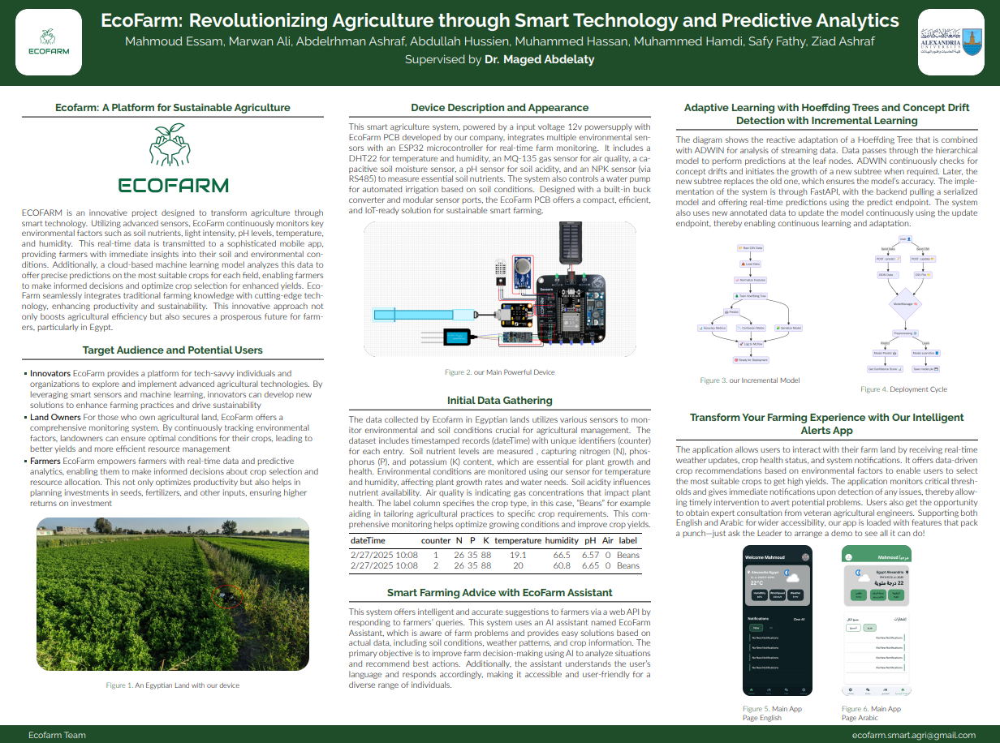

# 🌱 EcoFarm: Revolutionizing Agriculture with Smart Technology 🚀

## 📌 Project Overview

**EcoFarm** is an advanced **smart farming ecosystem** that combines **IoT sensors**, **machine learning**, and **cloud computing** to optimize agriculture. It provides **real-time environmental monitoring** and **crop predictions**, enabling farmers to make data-driven decisions, ensuring **maximum yield and sustainability**.

## 🚀 Key Features

✅ **Real-Time Environmental Monitoring**: Tracks soil nutrients, temperature, humidity, pH, and air quality.  
✅ **IoT-Driven Data Collection**: Uses **ESP32** and **specialized agricultural sensors**.  
✅ **AI-Powered Crop Prediction**: **Hoeffding Adaptive Tree Classifier (River package)** ensures continuous learning and adaptation.  
✅ **24/7 Cloud-Backed System**: Backend operates seamlessly to ensure uninterrupted performance.  
✅ **Mobile Application for Farmers**: Flutter-based app providing real-time monitoring & action control.  
✅ **Incremental Learning Model**: Updates continuously without requiring manual retraining.  
✅ **LLM-Based Chat Assistant**: AI-powered chatbot for agricultural guidance & problem-solving.  
✅ **Proven & Tested PCB**: Successfully validated through **24-hour testing** with **12,000+ real-world observations**.  
✅ **Azure-Based ML Deployment**: Ensuring seamless AI-driven decision-making.  

---

## 🏗 System Architecture

### **1️⃣ Hardware Components**

📌 **DHT22** - Monitors temperature & humidity.  
📌 **NPK Soil Sensor** - Analyzes essential soil nutrients (Nitrogen, Phosphorus, Potassium).  
📌 **Analog pH Sensor** - Measures soil acidity levels.  
📌 **MQ-135 Gas Sensor** - Detects air pollutants affecting crop health.  
📌 **ESP32 Devkit-V1** - Microcontroller for IoT integration & data transmission.  

### **2️⃣ Software Components**

🔹 **Backend**: Flask-based with FastAPI, integrating **MQTT & REST APIs**.  
🔹 **Database**: **Supabase (PostgreSQL)** for seamless data storage & retrieval.  
🔹 **Frontend**: Flutter-based **mobile app** for data visualization & control.  
🔹 **Cloud Services**: **Azure VM** powering the machine learning & analytics.  

---

## 🛠 Tech Stack

| 🔹 Component    | 🔹 Technology Used                                 |
| --------------- | -------------------------------------------------- |
| **IoT Devices** | ESP32, DHT22, MQ-135, NPK Sensor, pH Sensor V2     |
| **Backend**     | Flask, MQTT (HiveMQ), FastAPI                      |
| **Frontend**    | Flutter via FlutterFlow                            |
| **Database**    | Supabase (PostgreSQL)                              |
| **ML Models**   | Hoeffding Adaptive Tree Classifier (River package) |
| **Deployment**  | Azure VM, Docker, MLflow                           |

---

## 📊 Machine Learning Pipeline

### **1️⃣ Data Collection & EDA**

- **Sources**: IoT sensors, historical climate data.  
- **Features**: N, P, K, temperature, humidity, pH, rainfall.  
- **EDA Actions**: Feature engineering, correlation analysis, and pattern discovery.  

### **2️⃣ Model Training & Evaluation**

- **Hoeffding Adaptive Tree Classifier**: Built for real-time, incremental learning.  
- **Evaluation Metrics**: Accuracy, Precision, Recall, F1-score.  

### **3️⃣ Deployment & Continuous Monitoring**

- **MLflow** for experiment tracking & versioning.  
- **Supabase integration** for real-time data updates.  
- **Live analytics via Flutter App**.  

---

## 📱 Architecture Diagrams

---

## 📱 Poster to Summarize the Entire Project  

---

## 👥 Contributors  

| Name                 | Role                                                       |
| -------------------- | ---------------------------------------------------------- |
| **Mahmoud Essam**    | Leader - Machine Learning Engineer - IoT Dev - Flutter Dev - Cloud Architect|
| **Marwan Ali**       | IoT Developer - Cloud Architect                            |
| **Muhammed Hamdi**   | Flutter Developer                                          |
| **Abdullah Ibrahim** | Cloud Architect                                            |
| **Abdelrhman Ragab** | Data Scientist                                             |
| **Ziad Ashraf**      | Data Scientist                                             |
| **Safy Fathy**       | Flutter Developer                                          |
| **Muhammed Hassan**  | Cloud Architect                                            |

---

## 📬 Contact

📩 Connect with **Mahmoud Essam** on **[LinkedIn](https://www.linkedin.com/in/mahmoudessam7/)**.  

🚀 *Transforming agriculture, one smart farm at a time!* 🌱
